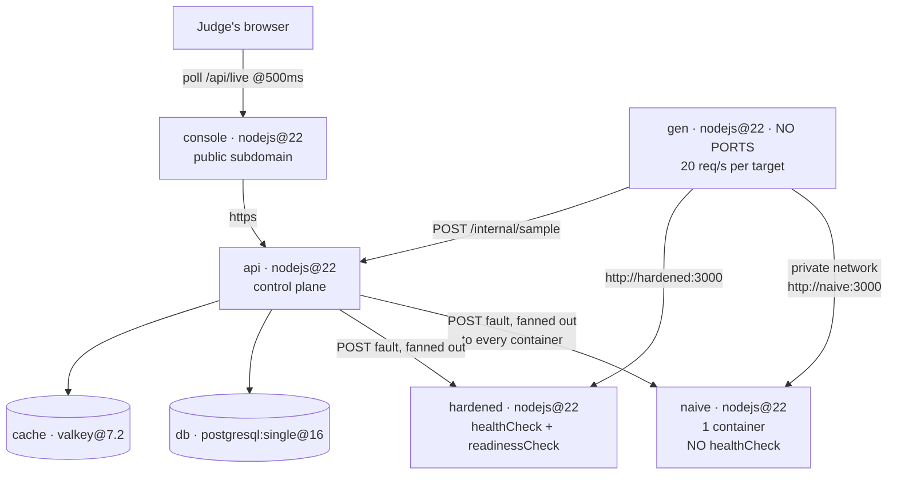

# Faultline

**Two identical Node services. Same code, same build, deployed twice. The only difference is six lines of Zerops config. Press a red button and watch it matter.**

🔴 **Live, no signup, break it yourself:** https://console-2db9-3000.prg1.zerops.app

Built for [The Zerops Challenge](https://www.wemakedevs.org/hackathons/zerops) (WeMakeDevs × Zerops), August 2026.

---

## The idea

Every platform tells you to configure health checks and run more than one container. Nobody shows you the bill for not doing it.

Faultline runs two byte-identical victim services inside one Zerops project:

- **`naive`** — 1 container, no `healthCheck`, no `readinessCheck`
- **`hardened`** — same binary, with both configured

A load generator hammers both over the private network at 20 req/s each, continuously, forever — so the page is already alive when you open it. There is no empty state and no seeded data. You press a fault button, the **same fault is injected into both services at the same instant**, and the two panels diverge in real time. Ninety seconds later you get a verdict card with the measured numbers and the exact `zerops.yml` block that made the difference.

It is a chaos lab whose output is a config diff.

## Try it in 20 seconds

1. Open **https://console-2db9-3000.prg1.zerops.app** — two live charts, already moving.
2. Press **HALF-DEAD PROCESS**.
3. Watch the left panel flood red and stay red. Watch the right one blip and recover.

No account. No credentials. Nothing to install.

## A real measured run

From the deployed system, not a mockup:

| | naive | hardened |
|---|---|---|
| Failed requests | **1800** | **80** |
| Consecutive failing seconds | **90** (the entire window) | **2** |
| Recovered on its own? | **No** — still broken when the window closed | **Yes** |

In a separate test, `naive` was left poisoned and checked four minutes later:

```
/work     HTTP 500
/healthz  HTTP 500
/whoami   {"pid":1125,"uptimeMs":396865}   <- same pid, never restarted
```

The process was alive the whole time. That is precisely why nothing restarted it: **Zerops can only rescue a service that told it how to check.**

## Architecture



| Service | Type | Role | Why separate |
|---|---|---|---|
| `console` | `nodejs@22` | The UI | Must survive the victims being deliberately destroyed |
| `api` | `nodejs@22` | Fault orchestration, live state, verdicts | Never a fault target — a judge can't break the page they're scoring |
| `gen` | `nodejs@22`, **no ports** | Continuous load generator | Portless long-running worker; sharing a process with the API would pollute its own latency measurements |
| `naive` | `nodejs@22` | Victim A — control group | Its fragility is pure config, not code |
| `hardened` | `nodejs@22` | Victim B — treatment group | Same binary. Two services running one codebase *is* the argument |
| `db` | `postgresql:single@16` | Run history | See "Current state" below |
| `cache` | `valkey@7.2` | Metric buckets | See "Current state" below |

## How Zerops is used

The A/B is expressed **entirely** in Zerops primitives. This project cannot be ported: on a serverless platform there are no containers to kill, no `healthCheck` to omit, and therefore nothing to measure.

| Zerops feature | Where | Why nothing simpler works |
|---|---|---|
| `run.healthCheck` | [`zerops.yml`](zerops.yml) `hardened` | The entire experiment. Omitted from `naive` deliberately |
| `deploy.readinessCheck` | `hardened`, `api`, `console` | Gates activation so a broken version never takes traffic |
| Private network by hostname | `gen` → `http://naive:3000` | No TLS, no service discovery, **no credentials in this repo** |
| `minContainers` / `maxContainers` | import YAML | Container-count contrast |
| Portless service | `gen` | A permanently-running worker with no public port |
| Project-scoped env | `${db_connectionString}` etc. | `envIsolation: none` — services read each other's connection strings directly |
| `zcli project project-import` | [`zerops-project-import.yaml`](zerops-project-import.yaml) | Whole topology as one file, one command |

## The two configurations

This is the whole product:

```yaml
- setup: naive                    - setup: hardened
  build:                            build:
    base: nodejs@22                   base: nodejs@22
    deployFiles: [apps/victim]        deployFiles: [apps/victim]   # same files
                                    deploy:
  # (nothing here)                   readinessCheck:
                                        httpGet: { port: 3000, path: /healthz }
  run:                              run:
    start: node apps/victim/index.js   start: node apps/victim/index.js
    # (nothing here)                 healthCheck:
                                        httpGet: { port: 3000, path: /healthz }
                                        failureTimeout: 15s
                                        disconnectTimeout: 10s
```

## The faults

| Fault | Mechanism | Zerops key it tests |
|---|---|---|
| **HALF-DEAD PROCESS** | `/healthz` and `/work` return 500; process stays alive | `run.healthCheck` |
| **KILL A CONTAINER** | `process.exit(1)` | supervisor restart + `minContainers` |
| **CPU SATURATION** | 60s busy loop pinning the event loop | `verticalAutoscaling` |

Faults are **fanned out to every container** of a service. An earlier single-request version produced a flattering `hardened: 0 failed` that measured nothing — the request had landed on a container serving no traffic. See the commit `Fan out fault injection to every container`.

## Decisions, and why

- **Polling at 500ms, not SSE.** SSE is barely documented on Zerops and the L7 balancer has a short response-transmission timeout. The charts look identical and nothing can silently stall.
- **Two services instead of one service with a toggle.** The claim is that the *config* is the difference. A runtime flag would prove nothing.
- **Measured over the private network, not the public URL.** The public L7 balancer serves 502 for ~2 minutes while a service is `REPAIRING`, even while healthy containers are serving. Measuring the public path would tell a false story.
- **`keepAlive: false` on the generator.** A pooled socket pins every request to one container, which makes a 2-container service look like a 1-container service and hides the effect being measured.
- **No object storage.** Nothing here needs a blob, and padding the topology is dishonest.

## What went wrong (and what the docs get wrong)

1. **`failureTimeout: 60` in the Zerops docs is wrong.** The API rejects bare integers: `cannot unmarshal !!int '30' into time.Duration`. They must be Go durations — `30s`.
2. **`retryPeriod` is clamped to `<10s, 1h>`.** `5s` is rejected outright.
3. **`zcli push` reads `zerops.yml`, not `zerops.yaml`.** The import file uses `.yaml`; the build file must be `.yml`.
4. **The `static` service type would not start.** 502 on every path and port, with completely empty application *and* webserver logs, across three configurations (`documentRoot`, `routing.root`, and `os: alpine` + `base: static` per the docs' own minimal example). The console is served by its own Node service instead — same isolation, guaranteed to boot. See [`apps/web-server/index.js`](apps/web-server/index.js).
5. **Killing a container is nearly invisible.** Zerops restarts a dead process in ~1 second. That is excellent engineering and a terrible demo, which is why the headline fault is the half-dead process instead.

Full measurements in [SPIKE-FINDINGS.md](SPIKE-FINDINGS.md).

## Current state

Honest accounting, because padding a service list is the first thing a judge should catch:

- `console`, `api`, `gen`, `naive`, `hardened` are **fully wired and doing real work**.
- `db` (PostgreSQL) **persists every completed run** and backs the "recent runs" wall — `GET /api/runs` reads it live. It is on the critical path, not decoration.
- `cache` (Valkey) is **provisioned and reachable but not yet on the live path.** The 120-second sample window lives in the `api` process today. Saying so is cheaper than pretending otherwise.
- `hardened` currently serves from **one** container despite `minContainers: 2`. Both containers boot — visible in its runtime log — but only one registers with the balancer after a service recreate. The half-dead result does not depend on container count: the health check is what recovers it.

## Run it yourself

```bash
zcli login <your-token>
zcli project project-import ./zerops-project-import.yaml
zcli push <service> --setup <service>   # per service
```

## AI disclosure

This project was built with **Claude Code (Claude Opus 5)** as a pair, and the hackathon requires that to be stated plainly.

The agent wrote most of the code and the Zerops configuration. What was not delegated: the decision to build a chaos lab rather than another dashboard, the call to spike the two riskiest unknowns before writing product code, the judgement to swap the headline fault from KILL to HALF-DEAD once the measurements showed a container restart takes ~1 second, and catching that the first `hardened: 0 failed` verdict was an artifact rather than a result.

Every number in this README came off the deployed system and can be reproduced by pressing the button.

## License

MIT
